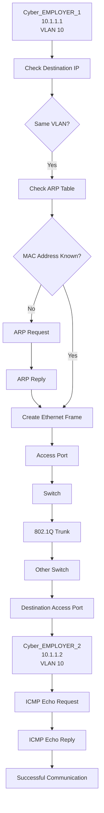

# 🌐 Enterprise-Multi-Router-OSPF-Network-Full-Mesh-Area-0

## 🎯 Objective

Build a basic LAN using two PCs and a Layer 2 switch
to understand IP addressing, subnetting, ARP, MAC learning,
and ICMP connectivity.

## 🖥️ Topology

PC1 ─── SW1 ─── PC2

## 🌐 IP Addressing

| Device | IP Address | Subnet Mask |
|---|---|---|
| PC1 | 192.168.10.10 | 255.255.255.0 |
| PC2 | 192.168.10.20 | 255.255.255.0 |

## 🔧 Technologies

- Cisco Packet Tracer
- IPv4
- Ethernet
- ARP
- ICMP
- MAC Address Table

## 🔍 Verification

### Ping Test

PC1 successfully pinged PC2.

### ARP Verification

Verified the IP-to-MAC mapping using:

arp -a

### Switch MAC Learning

Verified learned MAC addresses using:

show mac address-table

## 📊 Communication Process

### Same VLAN Communication

## ✅ Result

PC1 and PC2 successfully communicated through
the Layer 2 switch within the same IPv4 subnet.

## 📚 Key Learning

- IPv4 addressing
- Subnet identification
- ARP
- MAC address learning
- ICMP
- Basic Layer 2 communication
