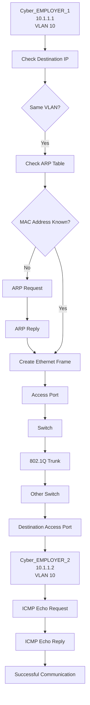

# 🌐 Enterprise-Multi-Router-OSPF-Network-Full-Mesh-Area-0

## 🎯 Project Objective

Design and implement a simulated enterprise campus network consisting of 4 routers, 3 Layer 2 switches, a centralized DHCP server, and 4 end hosts. Configure a fully meshed OSPF Area 0 topology to provide dynamic routing and network redundancy, implement DHCP relay to enable centralized IP address allocation across multiple subnets, and secure all network devices with SSH-only remote management. Finally, validate the complete network design through end-to-end connectivity testing and real-world Cisco IOS diagnostic and verification commands.

## 🖥️ Topology
<br>
<br>
<br>

<br>
<br>
<br>

## 🔢 IP Addressing


### Inter-Router Links

| Link | Network | R1 | R2 | R3 | R4 |
|---|---|---|---|---|---|
| R1 Gi0/0 ↔ R2 Gi0/0 | `12.1.1.0/30` | `12.1.1.1` | `12.1.1.2` | <div align="center">—</div> | <div align="center">—</div> |
| R1 Gi0/1 ↔ R3 Gi0/1 | `13.1.1.0/30` | `13.1.1.1` | <div align="center">—</div> | `13.1.1.2` | <div align="center">—</div> |
| R1 Gi0/2 ↔ R4 Gi0/1 | `14.1.1.0/30` | `14.1.1.1` | <div align="center">—</div> | <div align="center">—</div> | `14.1.1.2` |
| R2 Gi0/1 ↔ R3 Gi0/0 | `23.1.1.0/30` | <div align="center">—</div> | `23.1.1.1` | `23.1.1.2` | <div align="center">—</div> |
| R2 Gi0/2 ↔ R4 Gi0/2 | `24.1.1.0/30` | <div align="center">—</div> | `24.1.1.1` | <div align="center">—</div> | `24.1.1.2` |
| R3 Gi0/2 ↔ R4 Gi0/0 | `34.1.1.0/30` | <div align="center">—</div> | <div align="center">—</div> | `34.1.1.1` | `34.1.1.2` |

### LAN Segments

| LAN Segment | Network | Gateway | Devices |
|---|---|---|---|
| R2 Gi0/3 ↔ SW1 | `10.1.1.0/24` | `10.1.1.1` (R2) | PC1, PC2 — DHCP |
| R3 Gi0/3 ↔ SW2 | `20.1.1.0/24` | `20.1.1.1` (R3) | PC3 — DHCP |
| R4 Gi0/3 ↔ SW3 | `30.1.1.0/24` | `30.1.1.1` (R4) | PC4, DHCP Server `30.1.1.100` |

### Loopbacks & OSPF

| Router | Loopback | OSPF Process ID | OSPF Router ID | Area |
|---|---|:---:|:---:|---|
| R1 | `1.1.1.1/32` | `100` | `1.1.1.1` | Area 0 |
| R2 | `2.2.2.2/32` | `200` | `2.2.2.2` | Area 0 |
| R3 | `3.3.3.3/32` | `300` | `3.3.3.3` | Area 0 |
| R4 | `4.4.4.4/32` | `400` | `4.4.4.4` | Area 0 |

<br>
<br>
<br>

## 🔧 **Technologies**

- **EVE-NG**
- **Cisco IOS**
- **IPv4**
- **OSPFv2**
- **OSPF Area 0**
- **Full-Mesh Routing**
- **Static IP Addressing**
- **DHCP**
- **DHCP Relay** (`ip helper-address`)
- **IPv4 Subnetting**
- **Ethernet**
- **ARP**
- **ICMP**
- **SSH**
- **Cisco IOS CLI**
- **Routing Table Verification**
- **Network Connectivity & Troubleshooting**
<br>
<br>
<br>


# 🛠️ TASK TO PERFORM

## 🔹 Phase 1 — Basic Interface & OSPF Configuration

---

### 📍 1.1 R1 — Interface & OSPF Configuration

**Objective**

Configure R1's inter-router interfaces, Loopback interface, and OSPF process to establish dynamic routing and participate in the OSPF Area 0 domain.

#### ⚙️ Interface & OSPF Configuration


<br>


<br>

#### 🔍 Verification

**Interface Status**

```cisco
show ip interface brief
````

**OSPF Process**

```cisco
show ip ospf
```


### 📍 1.2 R2 — Interface & OSPF Configuration

**Objective**

Configure R2's inter-router interfaces, LAN interface, Loopback interface, and OSPF process to establish dynamic routing and participate in the OSPF Area 0 domain.

#### ⚙️ Interface & OSPF Configuration


<br>


<br>

#### 🔍 Verification

**Interface Status**

```cisco
show ip interface brief
```

**OSPF Process**

```cisco
show ip ospf
```


---

### 📍 1.3 R3 — Interface & OSPF Configuration

**Objective**

Configure R3's inter-router interfaces, LAN interface, Loopback interface, and OSPF process to establish dynamic routing and participate in the OSPF Area 0 domain.

#### ⚙️ Interface & OSPF Configuration


<br>


<br>

#### 🔍 Verification

**Interface Status**

```cisco
show ip interface brief
```

**OSPF Process**

```cisco
show ip ospf
```


---

### 📍 1.4 R4 — Interface & OSPF Configuration

**Objective**

Configure R4's inter-router interfaces, LAN interface, Loopback interface, and OSPF process to establish dynamic routing and participate in the OSPF Area 0 domain.

#### ⚙️ Interface & OSPF Configuration


<br>


<br>

#### 🔍 Verification

**Interface Status**

```cisco
show ip interface brief
```

**OSPF Process**

```cisco
show ip ospf
```


---

## ✅ Phase 1 — Completion Status

| Router | Interfaces | Loopback | OSPF Area 0 | Verification |
| :----: | :--------: | :------: | :---------: | :----------: |
| **R1** |      ✅     |     ✅    |      ✅      |       ✅      |
| **R2** |      ✅     |     ✅    |      ✅      |       ✅      |
| **R3** |      ✅     |     ✅    |      ✅      |       ✅      |
| **R4** |      ✅     |     ✅    |      ✅      |       ✅      |
<br>
<br>

**Phase 1 Result:**
All four routers have been configured with their required Layer 3 interfaces, Loopback interfaces, and OSPF Area 0 parameters. The topology is ready for OSPF neighbor establishment and subsequent DHCP Relay and SSH configuration phases.


## 🔹 Phase 2 — Inter-LAN Connectivity Verification

### 📍 2.1 PC3 → PC1 End-to-End Connectivity Test

#### 🎯 Objective

Verify end-to-end connectivity between **PC3 (`20.1.1.10`)** and **PC1 (`10.1.1.10`)** across different LAN networks using the configured **OSPF Area 0** routing topology.

This test validates that:
- PC3 can reach its default gateway **R3 (`20.1.1.1`)**
- OSPF has learned the **10.1.1.0/24** network
- Routers can forward traffic across the routed network
- PC1 can receive and respond to ICMP traffic from PC3

#### 🧪 Connectivity Test

**Source:** PC3 — `20.1.1.10`  
**Destination:** PC1 — `10.1.1.10`

```text
PC3 (20.1.1.10)
       │
       ▼
R3 (20.1.1.1)
       │
       │ OSPF Area 0
       ▼
   Routed Network
       │
       ▼
R2 (10.1.1.1)
       │
       ▼
PC1 (10.1.1.10)
````

#### 🔍 Verification

From **PC3**, send an ICMP ping to PC1:

```bash
ping 10.1.1.10
```

**Expected Result:**

```text
PC3> ping 10.1.1.10

84 bytes from 10.1.1.10 icmp_seq=1 ttl=... time=...
84 bytes from 10.1.1.10 icmp_seq=2 ttl=... time=...
84 bytes from 10.1.1.10 icmp_seq=3 ttl=... time=...
84 bytes from 10.1.1.10 icmp_seq=4 ttl=... time=...
```

Successful replies confirm that **PC3 can communicate with PC1 across different IP networks through the OSPF-routed topology**.

#### 🖥️ PC3 → PC1 Test Result

|      Source     |   Destination   | Protocol |    Result    |
| :-------------: | :-------------: | :------: | :----------: |
| PC3 `20.1.1.10` | PC1 `10.1.1.10` |   ICMP   | ✅ Successful |

#### 🧠 What This Test Demonstrates

The successful ping verifies the complete forwarding path:

**PC3 → R3 → OSPF-Routed Network → R2 → PC1**

It confirms that the **20.1.1.0/24** and **10.1.1.0/24** networks are reachable through the configured routing infrastructure and that end-to-end ICMP communication is working correctly.

```

### Recommended section title

I would use:

**`🔹 Phase 2 — Inter-LAN Connectivity Verification`**

rather than simply “Ping Test,” because it clearly communicates **what networking concept you are validating**, which looks more professional in a portfolio.
```


PC1 successfully pinged PC2.

### ARP Verification

Verified the IP-to-MAC mapping using:

arp -a

### Switch MAC Learning

Verified learned MAC addresses using:

show mac address-table

## 📊 Communication Process

### Same VLAN Communication


## ✅ Result

PC1 and PC2 successfully communicated through
the Layer 2 switch within the same IPv4 subnet.

## 📚 Key Learning

- IPv4 addressing
- Subnet identification
- ARP
- MAC address learning
- ICMP
- Basic Layer 2 communication
