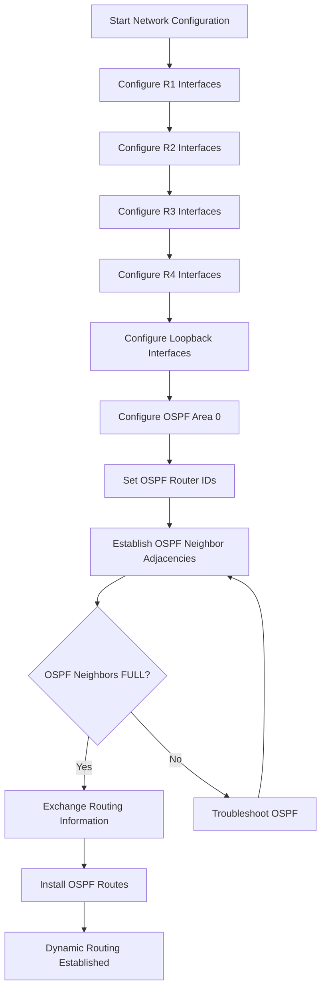
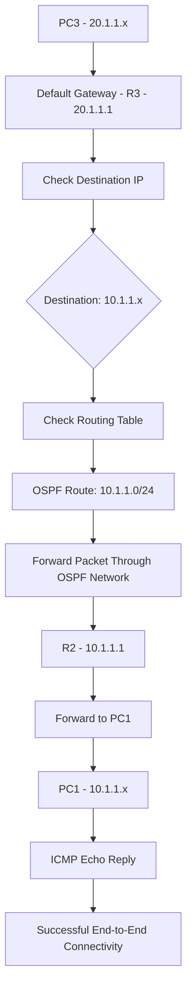
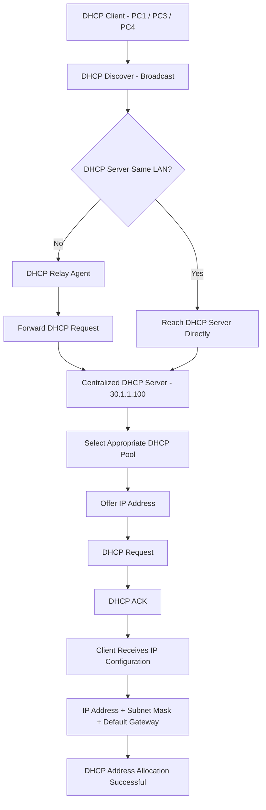
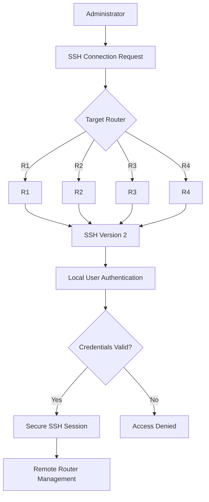

# 🌐 Enterprise Multi-Router OSPF Network — Full Mesh Area 0

## 🎯 Project Objective

Design and implement a simulated enterprise campus network consisting of 4 routers, 3 Layer 2 switches, a centralized DHCP server, and 4 end hosts. Configure a fully meshed OSPF Area 0 topology to provide dynamic routing and network redundancy, implement DHCP relay to enable centralized IP address allocation across multiple subnets, and secure all network devices with SSH-only remote management. Finally, validate the complete network design through end-to-end connectivity testing and real-world Cisco IOS diagnostic and verification commands.

---

# 🖥️ Topology

<br>


<br>

---

# 🔢 IP Addressing

## 🔗 Inter-Router Links

| Link | Network | R1 | R2 | R3 | R4 |
|:---|:---:|:---:|:---:|:---:|:---:|
| R1 Gi0/0 ↔ R2 Gi0/0 | `12.1.1.0/30` | `12.1.1.1` | `12.1.1.2` | <div align="center">—</div> | <div align="center">—</div> |
| R1 Gi0/1 ↔ R3 Gi0/1 | `13.1.1.0/30` | `13.1.1.1` | <div align="center">—</div> | `13.1.1.2` | <div align="center">—</div> |
| R1 Gi0/2 ↔ R4 Gi0/1 | `14.1.1.0/30` | `14.1.1.1` | <div align="center">—</div> | <div align="center">—</div> | `14.1.1.2` |
| R2 Gi0/1 ↔ R3 Gi0/0 | `23.1.1.0/30` | <div align="center">—</div> | `23.1.1.1` | `23.1.1.2` | <div align="center">—</div> |
| R2 Gi0/2 ↔ R4 Gi0/2 | `24.1.1.0/30` | <div align="center">—</div> | `24.1.1.1` | <div align="center">—</div> | `24.1.1.2` |
| R3 Gi0/2 ↔ R4 Gi0/0 | `34.1.1.0/30` | <div align="center">—</div> | <div align="center">—</div> | `34.1.1.1` | `34.1.1.2` |

---

## 🏢 LAN Segments

| LAN Segment | Network | Gateway | Devices |
|:---|:---:|:---:|:---|
| R2 Gi0/3 ↔ SW1 | `10.1.1.0/24` | `10.1.1.1` (R2) | PC1, PC2 — DHCP |
| R3 Gi0/3 ↔ SW2 | `20.1.1.0/24` | `20.1.1.1` (R3) | PC3 — DHCP |
| R4 Gi0/3 ↔ SW3 | `30.1.1.0/24` | `30.1.1.1` (R4) | PC4, DHCP Server `30.1.1.100` |

---

## 🔄 Loopbacks & OSPF

| Router | Loopback | OSPF Process ID | OSPF Router ID | Area |
|:---:|:---:|:---:|:---:|:---:|
| **R1** | `1.1.1.1/32` | `100` | `1.1.1.1` | Area 0 |
| **R2** | `2.2.2.2/32` | `200` | `2.2.2.2` | Area 0 |
| **R3** | `3.3.3.3/32` | `300` | `3.3.3.3` | Area 0 |
| **R4** | `4.4.4.4/32` | `400` | `4.4.4.4` | Area 0 |

---

# 🔧 Technologies

- **EVE-NG**
- **Cisco IOS**
- **IPv4**
- **OSPFv2**
- **OSPF Area 0**
- **Full-Mesh Routing**
- **Static IP Addressing**
- **DHCP**
- **DHCP Relay** (`ip helper-address`)
- **IPv4 Subnetting**
- **Ethernet**
- **ARP**
- **ICMP**
- **SSH**
- **Cisco IOS CLI**
- **Routing Table Verification**
- **Network Connectivity & Troubleshooting**

---

# 🛠️ TASK TO PERFORM

## 🔹 Phase 1 — Basic Interface & OSPF Configuration

---

### 📍 1.1 R1 — Interface & OSPF Configuration

#### 🎯 Objective

Configure R1's inter-router interfaces, Loopback interface, and OSPF process to establish dynamic routing and participate in the OSPF Area 0 domain.

#### ⚙️ Interface & OSPF Configuration


<br>


<br>

#### 🔍 Verification

**Interface Status**

```cisco
show ip interface brief
````

**OSPF Process**

```cisco
show ip ospf
```


---

### 📍 1.2 R2 — Interface & OSPF Configuration

#### 🎯 Objective

Configure R2's inter-router interfaces, LAN interface, Loopback interface, and OSPF process to establish dynamic routing and participate in the OSPF Area 0 domain.

#### ⚙️ Interface & OSPF Configuration


<br>


<br>

#### 🔍 Verification

**Interface Status**

```cisco
show ip interface brief
```

**OSPF Process**

```cisco
show ip ospf
```


---

### 📍 1.3 R3 — Interface & OSPF Configuration

#### 🎯 Objective

Configure R3's inter-router interfaces, LAN interface, Loopback interface, and OSPF process to establish dynamic routing and participate in the OSPF Area 0 domain.

#### ⚙️ Interface & OSPF Configuration


<br>


<br>

#### 🔍 Verification

**Interface Status**

```cisco
show ip interface brief
```

**OSPF Process**

```cisco
show ip ospf
```


---

### 📍 1.4 R4 — Interface & OSPF Configuration

#### 🎯 Objective

Configure R4's inter-router interfaces, LAN interface, Loopback interface, and OSPF process to establish dynamic routing and participate in the OSPF Area 0 domain.

#### ⚙️ Interface & OSPF Configuration


<br>


<br>

#### 🔍 Verification

**Interface Status**

```cisco
show ip interface brief
```

**OSPF Process**

```cisco
show ip ospf
```


---

## ✅ Phase 1 — Completion Status

| Router | Interfaces | Loopback | OSPF Area 0 | Verification |
| :----: | :--------: | :------: | :---------: | :----------: |
| **R1** |      ✅     |     ✅    |      ✅      |       ✅      |
| **R2** |      ✅     |     ✅    |      ✅      |       ✅      |
| **R3** |      ✅     |     ✅    |      ✅      |       ✅      |
| **R4** |      ✅     |     ✅    |      ✅      |       ✅      |

### 🔄 Phase 1 — Network Flow



### 📝 Phase 1 Result

All four routers have been configured with their required Layer 3 interfaces, Loopback interfaces, and OSPF Area 0 parameters. The topology is ready for OSPF neighbor establishment and subsequent DHCP Relay and SSH configuration phases.

---

# 🔹 Phase 2 — Inter-LAN Connectivity Verification

## 📍 2.1 PC3 → PC1 End-to-End Connectivity Test

### 🎯 Objective

Verify end-to-end connectivity between **PC3 (`20.1.1.10`)** and **PC1 (`10.1.1.10`)** across different LAN networks using the configured **OSPF Area 0** routing topology.

This test validates that:

* PC3 can reach its default gateway **R3 (`20.1.1.1`)**
* OSPF has learned the **10.1.1.0/24** network
* Routers can forward traffic across the routed network
* PC1 can receive and respond to ICMP traffic from PC3

### 🧪 Connectivity Test

**Source:** PC3 — `20.1.1.10`
**Destination:** PC1 — `10.1.1.10`

```text
PC3 (20.1.1.10)
       │
       ▼
R3 (20.1.1.1)
       │
       │ OSPF Area 0
       ▼
   Routed Network
       │
       ▼
R2 (10.1.1.1)
       │
       ▼
PC1 (10.1.1.10)
```

### 🔍 Verification

From **PC3**, send an ICMP ping to PC1:

```bash
ping 10.1.1.10
```

### 📸 Result


Successful replies confirm that **PC3 can communicate with PC1 across different IP networks through the OSPF-routed topology**.

### 🖥️ PC3 → PC1 Test Result

|        Source       |     Destination     | Protocol |    Result    |
| :-----------------: | :-----------------: | :------: | :----------: |
| **PC3 `20.1.1.10`** | **PC1 `10.1.1.10`** | **ICMP** | ✅ Successful |

### 🔄 Phase 2 — Connectivity Flow



---

# 🔹 Phase 3 — DHCP Relay Agent Configuration

## 📍 3.1 Centralized DHCP Server

### 🎯 Objective

Configure a centralized DHCP server at **`30.1.1.100`** to dynamically assign IPv4 addresses to clients located on different LAN networks.

Because DHCP client requests are initially sent as **broadcasts** and routers do not forward broadcast traffic by default, **DHCP Relay Agent** functionality is required on the routers connecting the client LANs to the centralized DHCP server.

### 🌐 DHCP Network Design

|      LAN      |    Network    | Default Gateway |  DHCP Server |
| :-----------: | :-----------: | :-------------: | :----------: |
| **PC1 / PC2** | `10.1.1.0/24` |    `10.1.1.1`   | `30.1.1.100` |
|    **PC3**    | `20.1.1.0/24` |    `20.1.1.1`   | `30.1.1.100` |
|    **PC4**    | `30.1.1.0/24` |    `30.1.1.1`   | `30.1.1.100` |

### 🌐 DHCP Server Information

| Parameter              | Configuration |
| :--------------------- | :-----------: |
| **DHCP Server IP**     |  `30.1.1.100` |
| **Server Network**     | `30.1.1.0/24` |
| **Default Gateway**    |   `30.1.1.1`  |
| **DHCP Service**       |    Enabled    |
| **Address Allocation** |    Dynamic    |

### ⚙️ DHCP Pool Configuration

<br>


<br>


<br>

### 🔍 Verification

**Interface Status**

```cisco
show ip interface brief
```

**DHCP Pool**

```cisco
show ip dhcp pool
```

<br>


---

## 📍 3.2 R2 — DHCP Relay Agent

### 🎯 Objective

Configure R2 as a DHCP Relay Agent for the **10.1.1.0/24** client network.

### ⚙️ Configuration

R2 provides connectivity to the **10.1.1.0/24** LAN containing PC1.

Configure the DHCP Relay Agent on the LAN-facing interface:

```cisco
interface g0/3
 ip helper-address 30.1.1.100
 no shutdown
end
write memory
```

The `ip helper-address` command enables R2 to forward DHCP requests received from the `10.1.1.0/24` LAN toward the centralized DHCP server.

---

## 📍 3.3 R3 — DHCP Relay Agent

### 🎯 Objective

Configure R3 as a DHCP Relay Agent for the **20.1.1.0/24** client network.

### ⚙️ Configuration

R3 provides connectivity to the **20.1.1.0/24** LAN containing PC3.

```cisco
interface g0/3
 ip helper-address 30.1.1.100
 no shutdown
end
write memory
```

R3 forwards DHCP requests from the **20.1.1.0/24** network toward the centralized DHCP server.

---

## 📍 3.4 R4 — DHCP Relay Agent

### 🎯 Objective

Configure R4 as a DHCP Relay Agent for the **30.1.1.0/24** LAN.

### ⚙️ Configuration

R4 provides connectivity to the **30.1.1.0/24** LAN containing PC4 and the centralized DHCP server.

```cisco
interface g0/3
 ip helper-address 30.1.1.100
 no shutdown
end
write memory
```

> **Note:** The DHCP server `30.1.1.100` and PC4 are on the same `30.1.1.0/24` LAN, so a DHCP relay is not technically required for PC4. The relay configuration is retained as part of this lab's router configuration.

<br>


---

## 📍 3.5 DHCP Client Configuration

After configuring the DHCP Relay Agents, configure the end hosts to obtain their IPv4 configuration dynamically from the centralized DHCP server.

### 🖥️ PC1 — DHCP

PC1 is connected to the **10.1.1.0/24** LAN.

Configure PC1 to obtain its IP address dynamically:

```text
PC1> ip dhcp
```

---

### 🖥️ PC3 — DHCP

PC3 is connected to the **20.1.1.0/24** LAN.

Configure PC3 for DHCP:

```text
PC3> ip dhcp
```

---

### 🖥️ PC4 — DHCP

PC4 is connected to the **30.1.1.0/24** LAN.

Configure PC4 for DHCP:

```text
PC4> ip dhcp
```

---

## 📍 3.6 DHCP Address Allocation Verification

Verify that the clients successfully receive addresses from their respective DHCP networks.

|  Client |    Network    | Default Gateway |  DHCP Server | Status |
| :-----: | :-----------: | :-------------: | :----------: | :----: |
| **PC1** | `10.1.1.0/24` |    `10.1.1.1`   | `30.1.1.100` |    ✅   |
| **PC3** | `20.1.1.0/24` |    `20.1.1.1`   | `30.1.1.100` |    ✅   |
| **PC4** | `30.1.1.0/24` |    `30.1.1.1`   | `30.1.1.100` |    ✅   |

---

## 📍 3.7 End-to-End Connectivity Testing

After receiving their IP addresses through DHCP, verify connectivity between the dynamically addressed hosts.

### 📊 Connectivity Verification

|  Source | Destination |    Test   | Result |
| :-----: | :---------: | :-------: | :----: |
| **PC3** |   **PC1**   | ICMP Ping |    ✅   |
| **PC4** |   **PC1**   | ICMP Ping |    ✅   |
| **PC1** |   **PC3**   | ICMP Ping |    ✅   |
| **PC1** |   **PC4**   | ICMP Ping |    ✅   |

### 📸 Result


### 🔄 Phase 3 — DHCP Flow



---

# 🔹 Phase 4 — SSH-Only Secure Remote Management

## 📍 4.1 SSH Configuration on R1

### 🎯 Objective

Enable **SSH version 2** on R1 to provide secure and encrypted remote management access.

Configure local user authentication and restrict remote VTY access to **SSH only**.

<br>


<br>

### 🔍 Verification

Verify that SSH is enabled and the VTY lines are configured for SSH-only access.

<br>


---

## 📍 4.2 SSH Configuration on R2

### 🎯 Objective

Enable **SSH version 2** on R2 for secure remote administration.

Configure local authentication and restrict remote management access to SSH.

<br>


<br>

### 🔍 Verification

Verify SSH status and VTY configuration on R2.

<br>


---

## 📍 4.3 SSH Configuration on R3

### 🎯 Objective

Enable **SSH version 2** on R3 to provide secure encrypted remote management.

Configure local authentication and allow SSH-only access through the VTY lines.

<br>


<br>

### 🔍 Verification

Verify SSH status and VTY configuration on R3.

<br>


---

## 📍 4.4 SSH Configuration on R4

### 🎯 Objective

Enable **SSH version 2** on R4 for secure remote administration.

Configure local authentication and restrict remote management access to SSH only.

<br>


<br>

### 🔍 Verification

Verify SSH status and VTY configuration on R4.

<br>


---

## 📊 SSH Configuration Verification

| Router | SSH Version | Authentication | Remote Access | Status |
| :----: | :---------: | :------------: | :-----------: | :----: |
| **R1** |    SSHv2    |   Local User   |    SSH Only   |    ✅   |
| **R2** |    SSHv2    |   Local User   |    SSH Only   |    ✅   |
| **R3** |    SSHv2    |   Local User   |    SSH Only   |    ✅   |
| **R4** |    SSHv2    |   Local User   |    SSH Only   |    ✅   |

---

<br>
<br>
Yes. Now the result is clear: **the issue was that SW2 needed Layer-3 routing enabled with a default route to R3**. Your screenshots now prove that SW2 can reach the remote router networks and establish SSH sessions.

For your GitHub README, I recommend adding the following **after 4.4 SSH Configuration on R4**, and **before the final Phase 4 Result**.

---

# 📍 4.5 Layer 3 Routing on SW2

### 🎯 Objective

Enable Layer 3 routing on SW2 and configure a default static route toward R3.

This allows SW2 to reach remote router networks, including the loopback networks of **R1, R2, R3, and R4**, and provides the required IP connectivity for SSH management.

### ⚙️ Configuration

```cisco
enable
configure terminal

ip routing

ip route 0.0.0.0 0.0.0.0 20.1.1.1

end
write memory
```

<br>
<br>


<br>
<br>

### 🔍 Verification

Verify the routing table on SW2:

```cisco
show ip route
```

The default route should point to R3:

```text
Gateway of last resort is 20.1.1.1 to network 0.0.0.0

S*    0.0.0.0/0 [1/0] via 20.1.1.1
C     20.1.1.0/24 is directly connected, Vlan1
L     20.1.1.2/32 is directly connected, Vlan1
```

The default route allows SW2 to forward traffic for destinations that are not directly connected through **R3 (20.1.1.1)**.

<br>
<br>


<br>
<br> 


---

# 📍 4.6 SSH Connectivity Verification from SW2

### 🎯 Objective

Verify remote SSH connectivity from SW2 to **R1, R2, R3, and R4** using their configured SSH accounts.

Successful login to each router confirms:

* IP connectivity between SW2 and the router
* SSH version 2 operation
* Local username authentication
* SSH-only VTY access
* Remote management capability

---

## 🔹 R1 SSH Verification

From SW2:

```cisco
Switch# ssh -l adminR1 1.1.1.1
```

After successful authentication:

```text
R1#
```

This confirms successful SSH access from SW2 to R1.
<br>
<br>


<br>
<br>
---

## 🔹 R2 SSH Verification

From SW2:

```cisco
Switch# ssh -l adminR2 2.2.2.2
```

After successful authentication:

```text
R2#
```

This confirms successful SSH access from SW2 to R2.
<br>
<br>

<br>
<br>

---

## 🔹 R3 SSH Verification

From SW2:

```cisco
Switch# ssh -l adminR3 3.3.3.3
```

After successful authentication:

```text
R3#
```

This confirms successful SSH access from SW2 to R3.
<br>
<br>

<br>
<br>

---

## 🔹 R4 SSH Verification

From SW2:

```cisco
Switch# ssh -l adminR4 4.4.4.4
```

After successful authentication:

```text
R4#
```

This confirms successful SSH access from SW2 to R4.
<br>
<br>


<br>
<br>
---

# 📊 SSH Connectivity Verification

|  Source | Destination | Destination IP | Authentication |    Result    |
| :-----: | :---------: | :------------: | :------------: | :----------: |
| **SW2** |    **R1**   |    `1.1.1.1`   |   Local User   | ✅ Successful |
| **SW2** |    **R2**   |    `2.2.2.2`   |   Local User   | ✅ Successful |
| **SW2** |    **R3**   |    `3.3.3.3`   |   Local User   | ✅ Successful |
| **SW2** |    **R4**   |    `4.4.4.4`   |   Local User   | ✅ Successful |

---

# 🧠 Phase 4 Result

SSH version 2 was successfully configured on **R1, R2, R3, and R4** with local user authentication and SSH-only VTY access.

Layer 3 routing was enabled on **SW2**, with a default route toward **R3 (`20.1.1.1`)** to provide connectivity to remote router networks.

SSH connectivity was successfully verified from **SW2 to R1, R2, R3, and R4**, demonstrating secure remote management across the routed network.

---


<br>
<br>


## 🔄  SSH Authentication Flow




## 🧠 Phase 4 Result

SSH version 2 was successfully enabled on **R1, R2, R3, and R4**.

Remote management access is restricted to **SSH**, providing encrypted communication between the administrator and the network devices.

---

# ✅ Result

PC1 and PC2 successfully communicated through the Layer 2 switch within the same IPv4 subnet.

---

# 📚 Key Learning

* IPv4 addressing
* Subnet identification
* ARP
* MAC address learning
* ICMP
* Basic Layer 2 communication

```

