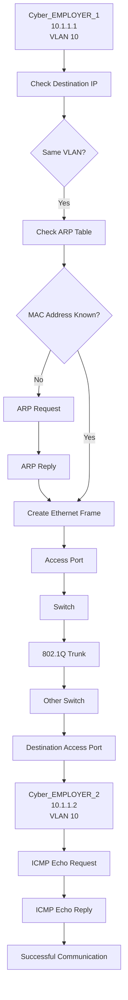

# 🌐 Enterprise-Multi-Router-OSPF-Network-Full-Mesh-Area-0

## 🎯 Project Objective

Design and implement a simulated enterprise campus network consisting of 4 routers, 3 Layer 2 switches, a centralized DHCP server, and 4 end hosts. Configure a fully meshed OSPF Area 0 topology to provide dynamic routing and network redundancy, implement DHCP relay to enable centralized IP address allocation across multiple subnets, and secure all network devices with SSH-only remote management. Finally, validate the complete network design through end-to-end connectivity testing and real-world Cisco IOS diagnostic and verification commands.

## 🖥️ Topology
 
 
 

 
 
 

## 🔢 IP Addressing

### Inter-Router Links

| Link | Network | R1 | R2 | R3 | R4 |
|---|---|---|---|---|---|
| R1 Gi0/0 ↔ R2 Gi0/0 | `12.1.1.0/30` | `12.1.1.1` | `12.1.1.2` | 
—
 | 
—
 |
| R1 Gi0/1 ↔ R3 Gi0/1 | `13.1.1.0/30` | `13.1.1.1` | 
—
 | `13.1.1.2` | 
—
 |
| R1 Gi0/2 ↔ R4 Gi0/1 | `14.1.1.0/30` | `14.1.1.1` | 
—
 | 
—
 | `14.1.1.2` |
| R2 Gi0/1 ↔ R3 Gi0/0 | `23.1.1.0/30` | 
—
 | `23.1.1.1` | `23.1.1.2` | 
—
 |
| R2 Gi0/2 ↔ R4 Gi0/2 | `24.1.1.0/30` | 
—
 | `24.1.1.1` | 
—
 | `24.1.1.2` |
| R3 Gi0/2 ↔ R4 Gi0/0 | `34.1.1.0/30` | 
—
 | 
—
 | `34.1.1.1` | `34.1.1.2` |

### LAN Segments

| LAN Segment | Network | Gateway | Devices |
|---|---|---|---|
| R2 Gi0/3 ↔ SW1 | `10.1.1.0/24` | `10.1.1.1` (R2) | PC1, PC2 — DHCP |
| R3 Gi0/3 ↔ SW2 | `20.1.1.0/24` | `20.1.1.1` (R3) | PC3 — DHCP |
| R4 Gi0/3 ↔ SW3 | `30.1.1.0/24` | `30.1.1.1` (R4) | PC4, DHCP Server `30.1.1.100` |

### Loopbacks & OSPF

| Router | Loopback | OSPF Process ID | OSPF Router ID | Area |
|---|---|:---:|:---:|---|
| R1 | `1.1.1.1/32` | `100` | `1.1.1.1` | Area 0 |
| R2 | `2.2.2.2/32` | `200` | `2.2.2.2` | Area 0 |
| R3 | `3.3.3.3/32` | `300` | `3.3.3.3` | Area 0 |
| R4 | `4.4.4.4/32` | `400` | `4.4.4.4` | Area 0 |

 
 
 
## 🔢 **IP Addressing**

- EVE-NG
- Cisco IOS
- IPv4
- OSPFv2
- OSPF Area 0
- Full-Mesh Routing
- Static IP Addressing
- DHCP
- DHCP Relay (`ip helper-address`)
- IPv4 Subnetting
- Ethernet
- ARP
- ICMP
- SSH
- Cisco IOS CLI
- Routing Table Verification
- Network Connectivity & Troubleshooting
 
 
 
## 🔍 Verification

### Ping Test

PC1 successfully pinged PC2.

### ARP Verification

Verified the IP-to-MAC mapping using:

arp -a

### Switch MAC Learning

Verified learned MAC addresses using:

show mac address-table

## 📊 Communication Process

### Same VLAN Communication

## ✅ Result

PC1 and PC2 successfully communicated through
the Layer 2 switch within the same IPv4 subnet.

## 📚 Key Learning

- IPv4 addressing
- Subnet identification
- ARP
- MAC address learning
- ICMP
- Basic Layer 2 communication
