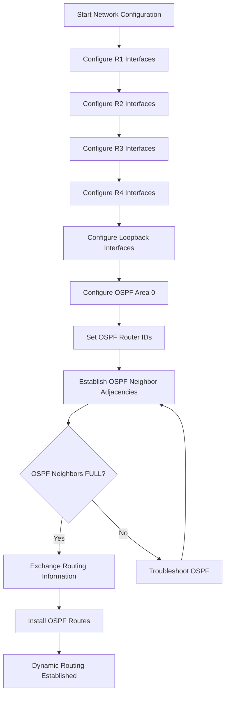
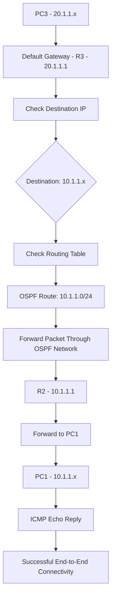
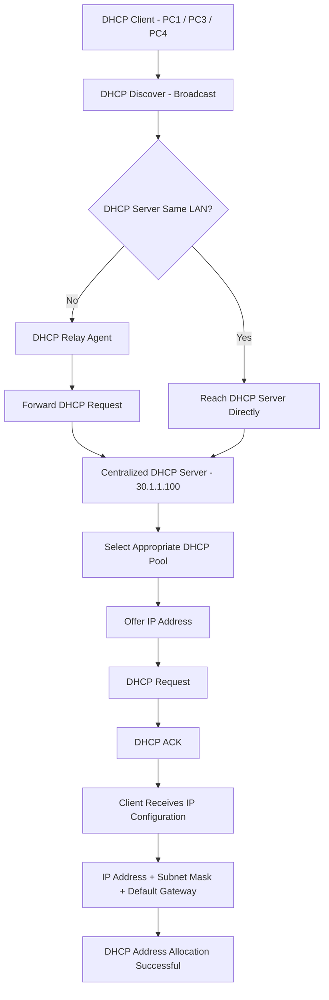
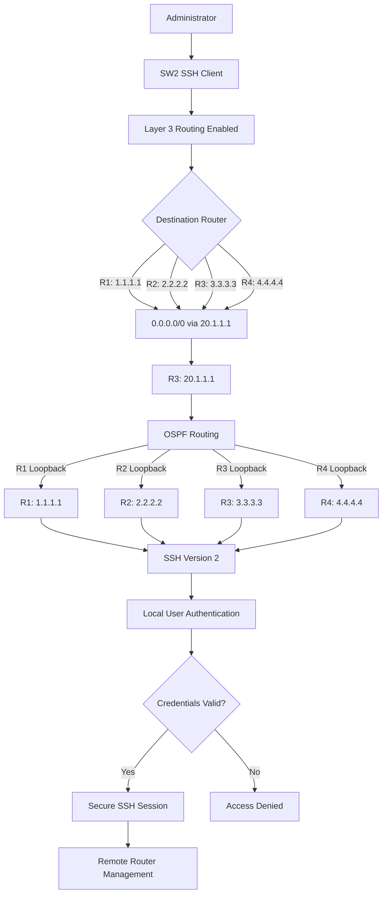

# 🌐 Enterprise Multi-Router OSPF Network

### Full-Mesh Area 0 • Centralized DHCP • SSH-Only Remote Management

> **Enterprise Network Simulation | Cisco IOS | EVE-NG | IPv4 | OSPFv2**

---


## 📑 Project Navigation


* [🎯 Project Objective](#-project-objective)
* [🖥️ Topology](#️-topology)
* [🔢 IP Addressing](#-ip-addressing)

  * [🔗 Inter-Router Links](#-inter-router-links)
  * [🏢 LAN Segments](#-lan-segments)
  * [🔄 Loopbacks & OSPF](#-loopbacks--ospf)
* [🔧 Technologies](#-technologies)
* [🛠️ Task to Perform](#️-task-to-perform)

  * [🔹 Phase 1 — Basic Interface & OSPF Configuration](#-phase-1--basic-interface--ospf-configuration)
  * [🔹 Phase 2 — Inter-LAN Connectivity Verification](#-phase-2--inter-lan-connectivity-verification)
  * [🔹 Phase 3 — DHCP Relay Agent Configuration](#-phase-3--dhcp-relay-agent-configuration)
  * [🔹 Phase 4 — SSH-Only Secure Remote Management](#-phase-4--ssh-only-secure-remote-management)
* [🧠 Key Learning](#-key-learning)

---

<div align="center">

**4 Routers** • **3 Layer 2 Switches** • **Centralized DHCP** • **OSPF Area 0** • **SSHv2**

</div>

---

## 🎯 Project Objective

Design and implement a simulated enterprise campus network consisting of 4 routers, 3 Layer 2 switches, a centralized DHCP server, and 4 end hosts. Configure a fully meshed OSPF Area 0 topology to provide dynamic routing and network redundancy, implement DHCP relay to enable centralized IP address allocation across multiple subnets, and secure all network devices with SSH-only remote management. Finally, validate the complete network design through end-to-end connectivity testing and real-world Cisco IOS diagnostic and verification commands.

---

# 🖥️ Topology

<br>


<br>

---

# 🔢 IP Addressing

## 🔗 Inter-Router Links

| Link                |    Network    |              R1             |              R2             |              R3             |              R4             |
| :------------------ | :-----------: | :-------------------------: | :-------------------------: | :-------------------------: | :-------------------------: |
| R1 Gi0/0 ↔ R2 Gi0/0 | `12.1.1.0/30` |          `12.1.1.1`         |          `12.1.1.2`         | <div align="center">—</div> | <div align="center">—</div> |
| R1 Gi0/1 ↔ R3 Gi0/1 | `13.1.1.0/30` |          `13.1.1.1`         | <div align="center">—</div> |          `13.1.1.2`         | <div align="center">—</div> |
| R1 Gi0/2 ↔ R4 Gi0/1 | `14.1.1.0/30` |          `14.1.1.1`         | <div align="center">—</div> | <div align="center">—</div> |          `14.1.1.2`         |
| R2 Gi0/1 ↔ R3 Gi0/0 | `23.1.1.0/30` | <div align="center">—</div> |          `23.1.1.1`         |          `23.1.1.2`         | <div align="center">—</div> |
| R2 Gi0/2 ↔ R4 Gi0/2 | `24.1.1.0/30` | <div align="center">—</div> |          `24.1.1.1`         | <div align="center">—</div> |          `24.1.1.2`         |
| R3 Gi0/2 ↔ R4 Gi0/0 | `34.1.1.0/30` | <div align="center">—</div> | <div align="center">—</div> |          `34.1.1.1`         |          `34.1.1.2`         |

---

## 🏢 LAN Segments

| LAN Segment    |    Network    |     Gateway     | Devices                       |
| :------------- | :-----------: | :-------------: | :---------------------------- |
| R2 Gi0/3 ↔ SW1 | `10.1.1.0/24` | `10.1.1.1` (R2) | PC1, PC2 — DHCP               |
| R3 Gi0/3 ↔ SW2 | `20.1.1.0/24` | `20.1.1.1` (R3) | PC3 — DHCP                    |
| R4 Gi0/3 ↔ SW3 | `30.1.1.0/24` | `30.1.1.1` (R4) | PC4, DHCP Server `30.1.1.100` |

---

## 🔄 Loopbacks & OSPF

| Router |   Loopback   | OSPF Process ID | OSPF Router ID |  Area  |
| :----: | :----------: | :-------------: | :------------: | :----: |
| **R1** | `1.1.1.1/32` |      `100`      |    `1.1.1.1`   | Area 0 |
| **R2** | `2.2.2.2/32` |      `200`      |    `2.2.2.2`   | Area 0 |
| **R3** | `3.3.3.3/32` |      `300`      |    `3.3.3.3`   | Area 0 |
| **R4** | `4.4.4.4/32` |      `400`      |    `4.4.4.4`   | Area 0 |

---

# 🔧 Technologies

* **EVE-NG**
* **Cisco IOS**
* **IPv4**
* **OSPFv2**
* **OSPF Area 0**
* **Full-Mesh Routing**
* **Static IP Addressing**
* **DHCP**
* **DHCP Relay** (`ip helper-address`)
* **IPv4 Subnetting**
* **Ethernet**
* **ARP**
* **ICMP**
* **SSH**
* **Cisco IOS CLI**
* **Routing Table Verification**
* **Network Connectivity & Troubleshooting**

---

# 🛠️ Task to Perform

## 🔹 Phase 1 — Basic Interface & OSPF Configuration

### 📍 1.1 R1 — Interface & OSPF Configuration

#### 🎯 Objective

Configure R1's inter-router interfaces, Loopback interface, and OSPF process to establish dynamic routing and participate in the OSPF Area 0 domain.

#### ⚙️ Interface & OSPF Configuration


<br>


<br>

#### 🔍 Verification

**Interface Status**

```cisco
show ip interface brief
```

**OSPF Process**

```cisco
show ip ospf
```


---

### 📍 1.2 R2 — Interface & OSPF Configuration

#### 🎯 Objective

Configure R2's inter-router interfaces, LAN interface, Loopback interface, and OSPF process to establish dynamic routing and participate in the OSPF Area 0 domain.

#### ⚙️ Interface & OSPF Configuration


<br>


<br>

#### 🔍 Verification

**Interface Status**

```cisco
show ip interface brief
```

**OSPF Process**

```cisco
show ip ospf
```


---

### 📍 1.3 R3 — Interface & OSPF Configuration

#### 🎯 Objective

Configure R3's inter-router interfaces, LAN interface, Loopback interface, and OSPF process to establish dynamic routing and participate in the OSPF Area 0 domain.

#### ⚙️ Interface & OSPF Configuration


<br>


<br>

#### 🔍 Verification

**Interface Status**

```cisco
show ip interface brief
```

**OSPF Process**

```cisco
show ip ospf
```


---

### 📍 1.4 R4 — Interface & OSPF Configuration

#### 🎯 Objective

Configure R4's inter-router interfaces, LAN interface, Loopback interface, and OSPF process to establish dynamic routing and participate in the OSPF Area 0 domain.

#### ⚙️ Interface & OSPF Configuration


<br>


<br>

#### 🔍 Verification

**Interface Status**

```cisco
show ip interface brief
```

**OSPF Process**

```cisco
show ip ospf
```


---

## ✅ Phase 1 — Completion Status

| Router | Interfaces | Loopback | OSPF Area 0 | Verification |
| :----: | :--------: | :------: | :---------: | :----------: |
| **R1** |      ✅     |     ✅    |      ✅      |       ✅      |
| **R2** |      ✅     |     ✅    |      ✅      |       ✅      |
| **R3** |      ✅     |     ✅    |      ✅      |       ✅      |
| **R4** |      ✅     |     ✅    |      ✅      |       ✅      |

### 🔄 Phase 1 — Network Flow



### 📝 Phase 1 Result

All four routers have been configured with their required Layer 3 interfaces, Loopback interfaces, and OSPF Area 0 parameters. The topology is ready for OSPF neighbor establishment and subsequent DHCP Relay and SSH configuration phases.

---

# 🔹 Phase 2 — Inter-LAN Connectivity Verification

### 📍 2.1 PC3 → PC1 End-to-End Connectivity Test

#### 🎯 Objective

Verify end-to-end connectivity between **PC3 (`20.1.1.10`)** and **PC1 (`10.1.1.10`)** across different LAN networks using the configured **OSPF Area 0** routing topology.

This test validates that:

* PC3 can reach its default gateway **R3 (`20.1.1.1`)**
* OSPF has learned the **10.1.1.0/24** network
* Routers can forward traffic across the routed network
* PC1 can receive and respond to ICMP traffic from PC3

### 🧪 Connectivity Test

**Source:** PC3 — `20.1.1.10`
**Destination:** PC1 — `10.1.1.10`

```text
PC3 (20.1.1.10)
       │
       ▼
R3 (20.1.1.1)
       │
       │ OSPF Area 0
       ▼
   Routed Network
       │
       ▼
R2 (10.1.1.1)
       │
       ▼
PC1 (10.1.1.10)
```

### 🔍 Verification

From **PC3**, send an ICMP ping to PC1:

```bash
ping 10.1.1.10
```

### 📸 Result


Successful replies confirm that **PC3 can communicate with PC1 across different IP networks through the OSPF-routed topology**.

### 🖥️ PC3 → PC1 Test Result

|        Source       |     Destination     | Protocol |    Result    |
| :-----------------: | :-----------------: | :------: | :----------: |
| **PC3 `20.1.1.10`** | **PC1 `10.1.1.10`** | **ICMP** | ✅ Successful |

### 🔄 Phase 2 — Connectivity Flow



---

# 🔹 Phase 3 — DHCP Relay Agent Configuration

## 📍 3.1 Centralized DHCP Server

### 🎯 Objective

Configure a centralized DHCP server at **`30.1.1.100`** to dynamically assign IPv4 addresses to clients located on different LAN networks.

Because DHCP client requests are initially sent as **broadcasts** and routers do not forward broadcast traffic by default, **DHCP Relay Agent** functionality is required on the routers connecting the client LANs to the centralized DHCP server.

### 🌐 DHCP Network Design

|      LAN      |    Network    | Default Gateway |  DHCP Server |
| :-----------: | :-----------: | :-------------: | :----------: |
| **PC1 / PC2** | `10.1.1.0/24` |    `10.1.1.1`   | `30.1.1.100` |
|    **PC3**    | `20.1.1.0/24` |    `20.1.1.1`   | `30.1.1.100` |
|    **PC4**    | `30.1.1.0/24` |    `30.1.1.1`   | `30.1.1.100` |

### 📋 DHCP Server Information

| Parameter       |           Configuration           |
| :-------------- | :-------------------------------: |
| **DHCP Server** |          `30.1.1.100/24`          |
| **Gateway**     |             `30.1.1.1`            |
| **Allocation**  |              Dynamic              |
| **R2 Pool**     |           `10.1.1.0/24`           |
| **R2 Excluded** |        `10.1.1.1–10.1.1.3`        |
| **R3 Pool**     |           `20.1.1.0/24`           |
| **R3 Excluded** |        `20.1.1.1–20.1.1.3`        |
| **R4 Pool**     |           `30.1.1.0/24`           |
| **R4 Excluded** | `30.1.1.1–30.1.1.3`, `30.1.1.100` |
| **DNS**         |             `8.8.8.8`             |
| **DHCP Relay**  |             Configured            |
| **Routing**     |            OSPF Area 0            |

### ⚙️ DHCP Pool Configuration

<br>


<br>


<br>

### 🔍 Verification

**Interface Status**

```cisco
show ip interface brief
```

**DHCP Pool**

```cisco
show ip dhcp pool
```

<br>


---

## 📍 3.2 R2 — DHCP Relay Agent

### 🎯 Objective

Configure R2 as a DHCP Relay Agent for the **10.1.1.0/24** client network.

### ⚙️ Configuration

R2 provides connectivity to the **10.1.1.0/24** LAN containing PC1.

Configure the DHCP Relay Agent on the LAN-facing interface:

```cisco
interface g0/3
 ip helper-address 30.1.1.100
 no shutdown
end
write memory
```

The `ip helper-address` command enables R2 to forward DHCP requests received from the `10.1.1.0/24` LAN toward the centralized DHCP server.

---

## 📍 3.3 R3 — DHCP Relay Agent

### 🎯 Objective

Configure R3 as a DHCP Relay Agent for the **20.1.1.0/24** client network.

### ⚙️ Configuration

R3 provides connectivity to the **20.1.1.0/24** LAN containing PC3.

```cisco
interface g0/3
 ip helper-address 30.1.1.100
 no shutdown
end
write memory
```

R3 forwards DHCP requests from the **20.1.1.0/24** network toward the centralized DHCP server.

---

## 📍 3.4 R4 — DHCP Relay Agent

### 🎯 Objective

Configure R4 as a DHCP Relay Agent for the **30.1.1.0/24** LAN.

### ⚙️ Configuration

R4 provides connectivity to the **30.1.1.0/24** LAN containing PC4 and the centralized DHCP server.

```cisco
interface g0/3
 ip helper-address 30.1.1.100
 no shutdown
end
write memory
```

> **Note:** The DHCP server `30.1.1.100` and PC4 are on the same `30.1.1.0/24` LAN, so a DHCP relay is not technically required for PC4. The relay configuration is retained as part of this lab's router configuration.

<br>


---

## 📍 3.5 DHCP Client Configuration

After configuring the DHCP Relay Agents, configure the end hosts to obtain their IPv4 configuration dynamically from the centralized DHCP server.

### 🖥️ PC1 — DHCP

PC1 is connected to the **10.1.1.0/24** LAN.

Configure PC1 to obtain its IP address dynamically:

```text
PC1> ip dhcp
```

---

### 🖥️ PC3 — DHCP

PC3 is connected to the **20.1.1.0/24** LAN.

Configure PC3 for DHCP:

```text
PC3> ip dhcp
```

---

### 🖥️ PC4 — DHCP

PC4 is connected to the **30.1.1.0/24** LAN.

Configure PC4 for DHCP:

```text
PC4> ip dhcp
```
<br>
<br>

<br>
<br>
Note : PC3 config is done only not capture .
---

## 📍 3.6 DHCP Address Allocation Verification

Verify that the clients successfully receive addresses from their respective DHCP networks.

|  Client |    Network    | Default Gateway |  DHCP Server | Status |
| :-----: | :-----------: | :-------------: | :----------: | :----: |
| **PC1** | `10.1.1.0/24` |    `10.1.1.1`   | `30.1.1.100` |    ✅   |
| **PC3** | `20.1.1.0/24` |    `20.1.1.1`   | `30.1.1.100` |    ✅   |
| **PC4** | `30.1.1.0/24` |    `30.1.1.1`   | `30.1.1.100` |    ✅   |

---

## 📍 3.7 End-to-End Connectivity Testing

After receiving their IP addresses through DHCP, verify connectivity between the dynamically addressed hosts.

### 📊 Connectivity Verification

|  Source | Destination |    Test   | Result |
| :-----: | :---------: | :-------: | :----: |
| **PC3** |   **PC1**   | ICMP Ping |    ✅   |
| **PC4** |   **PC1**   | ICMP Ping |    ✅   |
| **PC1** |   **PC3**   | ICMP Ping |    ✅   |
| **PC1** |   **PC4**   | ICMP Ping |    ✅   |

<br>


<br>

### 🔄 Phase 3 — DHCP Flow



---

# 🔹 Phase 4 — SSH-Only Secure Remote Management

## 📍 4.1 SSH Configuration on R1

### 🎯 Objective

Enable **SSH version 2** on R1 to provide secure and encrypted remote management access.

Configure local user authentication and restrict remote VTY access to **SSH only**.

<br>


<br>

### 🔍 Verification

Verify that SSH is enabled and the VTY lines are configured for SSH-only access.

<br>


---

## 📍 4.2 SSH Configuration on R2

### 🎯 Objective

Enable **SSH version 2** on R2 for secure remote administration.

Configure local authentication and restrict remote management access to SSH.

<br>


<br>

### 🔍 Verification

Verify SSH status and VTY configuration on R2.

<br>


---

## 📍 4.3 SSH Configuration on R3

### 🎯 Objective

Enable **SSH version 2** on R3 to provide secure encrypted remote management.

Configure local authentication and allow SSH-only access through the VTY lines.

<br>


<br>

### 🔍 Verification

Verify SSH status and VTY configuration on R3.

<br>


---

## 📍 4.4 SSH Configuration on R4

### 🎯 Objective

Enable **SSH version 2** on R4 for secure remote administration.

Configure local authentication and restrict remote management access to SSH only.

<br>


<br>

### 🔍 Verification

Verify SSH status and VTY configuration on R4.

<br>


---

## 📊 SSH Configuration Verification

| Router | SSH Version | Authentication | Remote Access | Status |
| :----: | :---------: | :------------: | :-----------: | :----: |
| **R1** |    SSHv2    |   Local User   |    SSH Only   |    ✅   |
| **R2** |    SSHv2    |   Local User   |    SSH Only   |    ✅   |
| **R3** |    SSHv2    |   Local User   |    SSH Only   |    ✅   |
| **R4** |    SSHv2    |   Local User   |    SSH Only   |    ✅   |

---

## 📍 4.5 Layer 3 Routing on SW2

### 🎯 Objective

Enable Layer 3 routing on SW2 and configure a default static route toward R3.

This allows SW2 to reach remote router networks, including the loopback networks of **R1, R2, R3, and R4**, and provides the required IP connectivity for SSH management.

### ⚙️ Configuration

```cisco
enable
configure terminal

ip routing

ip route 0.0.0.0 0.0.0.0 20.1.1.1

end
write memory
```

<br>
<br>


<br>
<br>

### 🔍 Verification

Verify the routing table on SW2:

```cisco
show ip route
```

The default route should point to R3:

```text
Gateway of last resort is 20.1.1.1 to network 0.0.0.0

S*    0.0.0.0/0 [1/0] via 20.1.1.1
C     20.1.1.0/24 is directly connected, Vlan1
L     20.1.1.2/32 is directly connected, Vlan1
```

The default route allows SW2 to forward traffic for destinations that are not directly connected through **R3 (20.1.1.1)**.

<br>
<br>


<br>
<br>

---

## 📍 4.6 SSH Connectivity Verification from SW2

### 🎯 Objective

Verify remote SSH connectivity from SW2 to **R1, R2, R3, and R4** using their configured SSH accounts.

Successful login to each router confirms:

* IP connectivity between SW2 and the router
* SSH version 2 operation
* Local username authentication
* SSH-only VTY access
* Remote management capability

---

### 🔹 R1 SSH Verification

From SW2:

```cisco
Switch# ssh -l adminR1 1.1.1.1
```

After successful authentication:

```text
R1#
```

This confirms successful SSH access from SW2 to R1.

<br>
<br>


<br>
<br>

---

### 🔹 R2 SSH Verification

From SW2:

```cisco
Switch# ssh -l adminR2 2.2.2.2
```

After successful authentication:

```text
R2#
```

This confirms successful SSH access from SW2 to R2.

<br>
<br>


<br>
<br>

---

### 🔹 R3 SSH Verification

From SW2:

```cisco
Switch# ssh -l adminR3 3.3.3.3
```

After successful authentication:

```text
R3#
```

This confirms successful SSH access from SW2 to R3.

<br>
<br>


<br>
<br>

---

### 🔹 R4 SSH Verification

From SW2:

```cisco
Switch# ssh -l adminR4 4.4.4.4
```

After successful authentication:

```text
R4#
```

This confirms successful SSH access from SW2 to R4.

<br>
<br>


<br>
<br>

---

# 📊 SSH Connectivity Verification

|  Source | Destination | Destination IP | Authentication |    Result    |
| :-----: | :---------: | :------------: | :------------: | :----------: |
| **SW2** |    **R1**   |    `1.1.1.1`   |   Local User   | ✅ Successful |
| **SW2** |    **R2**   |    `2.2.2.2`   |   Local User   | ✅ Successful |
| **SW2** |    **R3**   |    `3.3.3.3`   |   Local User   | ✅ Successful |
| **SW2** |    **R4**   |    `4.4.4.4`   |   Local User   | ✅ Successful |

---

# 🧠 Phase 4 Result

SSH version 2 was successfully configured on **R1, R2, R3, and R4** with local user authentication and SSH-only VTY access.

Layer 3 routing was enabled on **SW2**, with a default route toward **R3 (`20.1.1.1`)** to provide connectivity to remote router networks.

SSH connectivity was successfully verified from **SW2 to R1, R2, R3, and R4**, demonstrating secure remote management across the routed network.

---

## 🔄 SSH Authentication Flow



---

## 🧠 Phase 4 Result

SSH version 2 was successfully enabled on **R1, R2, R3, and R4**.

Remote management access is restricted to **SSH**, providing encrypted communication between the administrator and the network devices.

---
<br>
<br>


# 🔧 Phase 5 — Network Troubleshooting & Verification

### 🛠️ Diagnosing Routing, Reachability, and DHCP Relay Issues

This phase focuses on identifying, resolving, and verifying real network
connectivity issues encountered during the implementation of the enterprise
OSPF network.

The troubleshooting process followed a structured approach:

**Problem → Investigation → Root Cause → Resolution → Verification**

---

# 📡 Troubleshooting Case 1 — DHCP Relay Failure

### 🔎 Diagnosing DHCP Address Assignment Across a Routed Network

During DHCP verification, the client connected to the R3 LAN was initially
unable to obtain an IP address from the centralized DHCP server.

The DHCP server was located on a different IP network from the client.
Therefore, DHCP broadcast requests could not cross the routed network
without DHCP relay functionality.

---

## 🎯 Problem

The VPCS client connected to the R3 LAN attempted to obtain an IP address
using DHCP.

The initial DHCP request failed and the client reported that it could not
find a DHCP server.

### 📸 Evidence — Initial DHCP Failure


### 🔎 Observation

The client was connected to the `20.1.1.0/24` network, while the centralized
DHCP server was located on the `30.1.1.0/24` network.

Because DHCP Discover messages are broadcast-based, the request could not
normally cross the Layer 3 boundary between these networks.

This indicated that DHCP relay functionality on the R3 client-facing
interface needed to be investigated.

---

## 🔍 Investigation

The R3 LAN interface was examined because it acts as the default gateway
for the client network.

### 📡 R3 Client Network

| Component | Address |
|---|---|
| Client Network | `20.1.1.0/24` |
| R3 Gateway | `20.1.1.1/24` |
| DHCP Server | `30.1.1.100` |

The R3 interface connected to the client network was confirmed as the
DHCP relay point.

### 📸 Evidence — R3 LAN Interface


---

## 🧠 Root Cause Analysis

The centralized DHCP server was operational and already had a DHCP pool
configured for the R3 client network `20.1.1.0/24`.

However, the R3 client-facing interface `GigabitEthernet0/3` did not
initially have a DHCP relay configuration.

Because the DHCP client and centralized DHCP server were located on
different Layer 3 networks, the client's DHCP broadcast could not cross
the router by itself.

The missing DHCP relay configuration on R3 `Gi0/3` prevented the DHCP
request from being forwarded to the centralized DHCP server.

### 📸 Evidence — DHCP Server / Pool Verification


### 📌 Identified Root Cause

**R3 `GigabitEthernet0/3` — DHCP relay (`ip helper-address`) was not
configured.**

### 🔄 DHCP Request Path Before Fix

**VPCS Client**  
`20.1.1.0/24`

⬇️ DHCP Broadcast

**R3 Gi0/3**  
`20.1.1.1/24`

⬇️ ❌ DHCP Relay Not Configured

**DHCP Server**  
`30.1.1.100`

As a result, the client reported that it could not find a DHCP server.

### 📸 Evidence — R3 Configuration Check


The verification confirmed that the DHCP relay configuration on the R3
client-facing interface required correction.

---

## 🛠️ Resolution

DHCP relay functionality was established on the R3 client-facing
interface so that DHCP requests from the `20.1.1.0/24` network could be
forwarded to the centralized DHCP server at `30.1.1.100`.

The configuration was then saved and verified.

### 📸 Evidence — DHCP Relay Configuration


---

## 🔎 DHCP Relay Verification — R3

After configuring the DHCP relay on R3 `Gi0/3`, the configuration was
verified to confirm that DHCP requests from the `20.1.1.0/24` client
network are forwarded to the centralized DHCP server at `30.1.1.100`.

### 📸 Evidence — R3 DHCP Relay Verification


**Verification Result:**  
✅ DHCP relay is configured on R3 `Gi0/3` and points to the centralized
DHCP server `30.1.1.100`.

---

## ✅ Post-Fix Verification

After correcting the DHCP relay path, the VPCS client successfully
obtained its network configuration through DHCP.

The client received:

- **IP Address:** `20.1.1.4/24`
- **Default Gateway:** `20.1.1.1`

### 📸 Evidence — Successful DHCP Assignment


This confirmed that the DHCP request successfully travelled from the
client network through R3 to the centralized DHCP server and that the
DHCP response successfully returned to the client.

---

## 🔄 DHCP Communication Flow

The final working DHCP path can be represented as:

**VPCS Client**  
`20.1.1.0/24`

⬇️ DHCP Broadcast

**R3 — DHCP Relay**  
`20.1.1.1`

⬇️ Relayed DHCP Request

**Centralized DHCP Server**  
`30.1.1.100`

⬇️ DHCP Response

**R3**

⬇️

**VPCS Client**

⬇️

**`20.1.1.4/24` Assigned**

---

## 🧠 Troubleshooting Methodology

The issue was isolated using the following process:

**DHCP Request**  
↓  
**Observe Failure**  
↓  
**Verify Client Network**  
↓  
**Verify R3 Gateway Interface**  
↓  
**Check DHCP Relay Function**  
↓  
**Verify Centralized DHCP Pool**  
↓  
**Restore DHCP Relay Forwarding**  
↓  
**Request DHCP Address Again**  
↓  
**Verify Assigned IP and Gateway**

---

## 🏁 Final Outcome

The DHCP troubleshooting process successfully demonstrated:

- ✅ Identification of DHCP address-assignment failure
- ✅ Verification of the client-side gateway
- ✅ Analysis of DHCP relay functionality
- ✅ Verification of the centralized DHCP pool
- ✅ Successful DHCP address allocation
- ✅ Correct default-gateway assignment
- ✅ End-to-end DHCP communication across routed networks

---

# 🌐 Troubleshooting Case 2 — Remote Network Reachability

### 🛠️ Diagnosing Reachability and Validating Network Connectivity

This case focuses on troubleshooting and validating the communication
between the management switch and the routers within the enterprise
OSPF network.

The objective was not only to verify that the network was operational,
but also to identify connectivity problems, analyze the routing behavior,
apply the required correction, and verify the result.

---

## 🎯 Objective

The main objectives of this case were:

- Verify local and remote network connectivity
- Identify communication failures
- Analyze the available routing information
- Determine why remote router loopbacks were unreachable
- Restore the required network reachability
- Verify end-to-end connectivity after the correction
- Validate remote router management through SSH

---

## 🔍 Troubleshooting Scenario

During the initial verification, the management switch was able to
communicate with the local/upstream network but was unable to reach
remote router loopback interfaces.

The remote loopbacks represent the management addresses of the routers:

- R1 — `1.1.1.1/32`
- R2 — `2.2.2.2/32`
- R3 — `3.3.3.3/32`
- R4 — `4.4.4.4/32`

This indicated that basic local connectivity was working, while
communication toward remote networks required further investigation.

---

## 📊 Initial Connectivity Verification

The first step was to test connectivity from the switch toward both
local and remote destinations.

The switch successfully reached the local router interface, confirming
that the directly connected network was operational.

However, attempts to reach the remote router loopbacks were unsuccessful.

### 📸 Evidence — Initial Connectivity Test


**Observation:**  
Local connectivity was successful, but remote loopback connectivity
failed. This indicated that the issue was related to reaching networks
beyond the directly connected segment rather than a complete loss of
connectivity.

---

## 🧠 Root Cause Analysis

The routing information on the switch was examined to determine whether
a valid path existed toward the remote router loopbacks.

The investigation showed that the switch had knowledge of its directly
connected network but did not have an appropriate route for destinations
outside that network.

As a result, packets destined for remote router loopbacks had no suitable
forwarding path.

### 📸 Evidence — Routing Table Verification


**Finding:**  
The absence of a suitable default path prevented the switch from
forwarding traffic toward remote destinations.

---

## 🛠️ Resolution

A suitable default forwarding path was established toward the upstream
router.

This allowed the switch to forward traffic for destinations that were
not directly present in its routing table.

The routing table was then verified again to confirm that the required
forwarding path was present.

### 📸 Evidence — Updated Routing Information


**Result:**  
The routing table now contained a valid default path toward the upstream
router, allowing traffic destined for remote networks to be forwarded
through the enterprise routing infrastructure.

---

## ✅ Post-Fix Connectivity Verification

After correcting the routing path, connectivity was tested again toward
the remote router loopbacks.

The successful responses confirmed that the switch could now forward
traffic beyond its directly connected network.

### 📸 Evidence — Successful Connectivity


**Verification Result:**

| Verification | Result |
|---|---|
| Local router reachability | ✅ Successful |
| R1 loopback reachability | ✅ Successful |
| R2 loopback reachability | ✅ Successful |
| Remote network forwarding | ✅ Verified |

---

## 🔐 SSH Management Verification

Once IP connectivity was restored, SSH connectivity was tested to verify
that the network could support secure remote administration.

The successful SSH session confirmed that the management switch could
reach the router's management address and establish an authenticated
remote session.

### 📸 Evidence — SSH Management Access


**Verification Result:**

- IP reachability — ✅ Verified
- SSH service reachability — ✅ Verified
- Authentication — ✅ Successful
- Remote management — ✅ Operational

---

## 🧠 Troubleshooting Approach

The issue was isolated using a structured troubleshooting methodology:

**Connectivity Test**  
↓  
**Identify the Failed Destination**  
↓  
**Analyze Routing Information**  
↓  
**Identify Missing Forwarding Path**  
↓  
**Correct the Routing Configuration**  
↓  
**Retest Connectivity**  
↓  
**Verify SSH Management**

This approach demonstrates the use of a systematic troubleshooting
process rather than making configuration changes without first identifying
the cause of the problem.

---

## 🏁 Final Outcome

The troubleshooting case successfully demonstrated practical network
troubleshooting and verification skills.

### 📌 Key Results

- ✅ Local connectivity verified
- ✅ Remote reachability problem identified
- ✅ Routing information analyzed
- ✅ Missing forwarding path identified
- ✅ Routing path corrected
- ✅ Remote router loopbacks successfully reached
- ✅ SSH management connectivity verified

This case validated that the enterprise network was not only configured
but also **tested, analyzed, and verified from an administrator's
perspective**.


## 🏆 Project Result

The enterprise network was successfully designed and implemented in **EVE-NG** using a fully meshed four-router topology with **OSPF Area 0**, centralized DHCP, DHCP relay, VLAN-based LAN connectivity, and secure remote management.

The implementation successfully achieved:

- ✅ Established OSPF neighbor relationships across the four-router full-mesh topology.
- ✅ Achieved dynamic routing and redundant path connectivity using **OSPF Area 0**.
- ✅ Implemented centralized DHCP with **DHCP Relay** for remote LANs.
- ✅ Verified successful IP address allocation to end hosts.
- ✅ Implemented **SSH Version 2** with local authentication on R1, R2, R3, and R4.
- ✅ Restricted VTY remote access to **SSH only**.
- ✅ Enabled Layer 3 routing on SW2 and configured a default route toward R3 for remote management connectivity.
- ✅ Successfully verified SSH access from **SW2 to R1, R2, R3, and R4**.
- ✅ Performed connectivity and routing verification using Cisco IOS troubleshooting commands.

Overall, the project demonstrates the implementation of a **routed enterprise network with dynamic routing, centralized IP address management, and secure remote administration**.

---

## 🧠 Key Learnings

Through this project, I gained practical experience in the following areas:

### 🔹 Routing & OSPF

- Understanding and configuring **OSPF Area 0**.
- Establishing and troubleshooting **OSPF neighbor relationships**.
- Understanding **routing tables, next-hop selection, and route propagation**.
- Implementing a **full-mesh routed topology** for redundancy.

### 🔹 DHCP & IP Address Management

- Configuring a **centralized DHCP server**.
- Understanding the difference between **local DHCP and DHCP Relay**.
- Configuring `ip helper-address` to forward DHCP requests across routed networks.
- Verifying **DHCP leases and client connectivity**.

### 🔹 Layer 2 & Layer 3

- Understanding the difference between **Layer 2 switching and Layer 3 routing**.
- Configuring and managing **SVIs**.
- Understanding the difference between `ip default-gateway` and a **Layer 3 default route**.
- Troubleshooting connectivity between **directly connected and remote networks**.

### 🔹 Network Security

- Configuring **SSH Version 2** for encrypted remote management.
- Implementing **local user authentication**.
- Restricting VTY access to **SSH only**.
- Understanding why **SSH is preferred over Telnet** for secure remote device management.

### 🔹 Network Troubleshooting


Gained practical experience using Cisco IOS verification and troubleshooting commands such as:

```text
show ip route
show ip ospf neighbor
show ip interface
show ip arp
show interfaces
show ip ssh
ping
traceroute
```

🎯 Key Takeaway

This project strengthened my practical understanding of enterprise networking by combining routing, switching, DHCP, OSPF, network troubleshooting, and secure SSH-based device management in a simulated EVE-NG environment.
